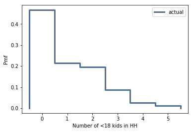

[Think Stats Chapter 3 Exercise 1](http://greenteapress.com/thinkstats2/html/thinkstats2004.html#toc31) (actual vs. biased)

```python
resp = nsfg.ReadFemResp()
kids = resp['numkdhh']

hist = thinkstats2.Hist(kids, label='hh_children')
thinkplot.Hist(hist)
thinkplot.Config(xlabel='Number of <18 kids in HH', ylabel='Count')
```


```python
pmf = thinkstats2.Pmf(kids, label='actual')
thinkplot.Hist(pmf)
thinkplot.Config(xlabel='Number of <18 kids in HH', ylabel='Pmf')
```


```python
thinkplot.Pmf(pmf)
thinkplot.Config(xlabel='Number of <18 kids in HH', ylabel='Pmf')
```



```python
biased_pmf = pmf.Copy(label='observed')

for x, p in pmf.Items():
    biased_pmf.Mult(x, x)

biased_pmf.Normalize()

thinkplot.PrePlot(2)
thinkplot.Pmfs([pmf, biased_pmf])
thinkplot.Config(xlabel='Number of <18 kids in HH', ylabel='PMF')
```


```python
print('Actual mean', pmf.Mean())
print('Observed mean', biased_pmf.Mean())
```

>> Actual mean 1.024205155043831  
Observed mean 2.403679100664282
