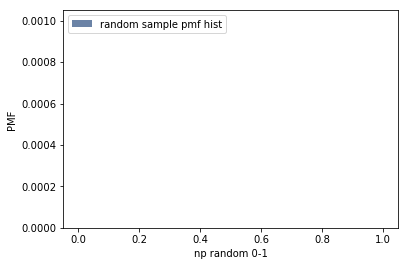
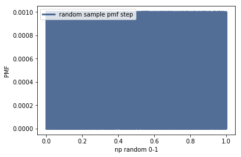
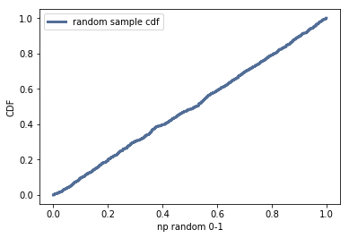

[Think Stats Chapter 4 Exercise 2](http://greenteapress.com/thinkstats2/html/thinkstats2005.html#toc41) (a random distribution)

```python
rs = np.random.random(1000)
rs_pmf = thinkstats2.Pmf(rs, label='random sample pmf hist')
thinkplot.Hist(rs_pmf)
thinkplot.Config(xlabel='np random 0-1', ylabel='PMF')
```



>> looks like there are too many numbers to plot PMFs for on a small chart

```python
thinkplot.Pmf(rs_pmf, label='random sample pmf step')
thinkplot.Config(xlabel='np random 0-1', ylabel='PMF')
```



>> step function graph reveals the (very busy) outlines of the PMF for each random number

```python
rs_cdf = thinkstats2.Cdf(rs, label='random sample cdf')
thinkplot.Cdf(rs_cdf)
thinkplot.Config(xlabel='np random 0-1', ylabel='CDF')
```



>> now we see that the distribution of random numbers generated by np.random appears to be uniform, as shown by its CDF (linear on chart)
